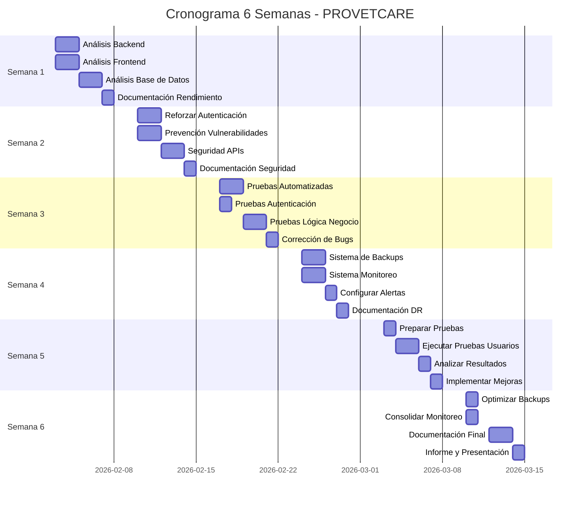

# 📅 Planificación de 6 Semanas - PROVETCARE

**Sistema Web para Agendamiento de Citas Veterinarias**  
Organización del proyecto en 6 semanas de clasificación según metodología SDLC

---

## 📋 Índice

- [Visión General](#-visión-general)
- [Semana 1: Análisis de Rendimiento del Sistema](#-semana-1-análisis-de-rendimiento-del-sistema)
- [Semana 2: Implementación de Medidas de Seguridad](#-semana-2-implementación-de-medidas-de-seguridad)
- [Semana 3: Pruebas de Vulnerabilidad y Corrección de Fallos](#-semana-3-pruebas-de-vulnerabilidad-y-corrección-de-fallos)
- [Semana 4: Copias de Respaldo y Monitoreo Continuo](#-semana-4-copias-de-respaldo-y-monitoreo-continuo-del-sistema)
- [Semana 5: Aplicación de Pruebas de Usuario e Informe](#-semana-5-aplicación-de-pruebas-de-usuario-e-informe-de-hallazgos)
- [Semana 6: Copias de Respaldo y Monitoreo Final](#-semana-6-copias-de-respaldo-y-monitoreo-continuo-final)
- [Entregables](#-entregables)
- [Cronograma de Actividades](#-cronograma-de-actividades)

---

## 🎯 Visión General

Este documento organiza el proyecto PROVETCARE en 6 semanas de trabajo enfocadas en:
1. Optimización del rendimiento
2. Fortalecimiento de la seguridad
3. Detección y corrección de vulnerabilidades
4. Implementación de backups y monitoreo
5. Validación con usuarios reales
6. Consolidación y monitoreo final

---

## 📊 SEMANA 1: Análisis de Rendimiento del Sistema

**Objetivo:** Evaluar y optimizar el rendimiento actual del sistema PROVETCARE

### 🎯 Actividades Principales

#### 1. Análisis de Rendimiento Backend

- **Análisis de Queries SQL**
  - Revisar queries en todas las rutas principales
  - Identificar consultas N+1
  - Medir tiempos de respuesta de endpoints críticos
  - Analizar uso de índices en PostgreSQL

- **Análisis de API Endpoints**
  - Medir tiempo de respuesta de cada endpoint
  - Identificar endpoints lentos (>500ms)
  - Revisar uso de memoria en procesos NodeJS
  - Analizar uso de CPU durante cargas pico

- **Testing de Carga**
  - Simular 50+ usuarios concurrentes
  - Probar endpoints críticos:
    - `/api/appointments` - Listado de citas
    - `/api/pets` - Gestión de mascotas
    - `/api/chat/messages` - Chat en tiempo real
    - `/api/medical-records` - Historial médico

#### 2. Análisis de Rendimiento Frontend

- **Análisis de Bundle Size**
  - Ejecutar `npm run build` y analizar tamaño
  - Identificar dependencias pesadas
  - Medir First Contentful Paint (FCP)
  - Medir Time to Interactive (TTI)

- **Optimización de Componentes React**
  - Identificar re-renders innecesarios
  - Analizar uso de React.memo
  - Revisar lazy loading de rutas
  - Optimizar carga de imágenes

- **Performance con Lighthouse**
  - Ejecutar auditoría en páginas clave:
    - Dashboard
    - Calendario
    - Historial Médico
    - Chat

#### 3. Análisis de Base de Datos

- **Optimización de PostgreSQL**
  - Revisar plan de ejecución (EXPLAIN ANALYZE)
  - Identificar tablas sin índices apropiados
  - Analizar tamaño de tablas y uso de disco
  - Revisar fragmentación de índices

- **Consultas Específicas a Analizar**
  ```sql
  -- Vista de historial médico completo
  SELECT * FROM v_medical_history_full;
  
  -- Consulta de citas con joins
  SELECT * FROM appointments 
  JOIN users ON appointments.user_id = users.id
  JOIN pets ON appointments.pet_id = pets.id;
  
  -- Chat con paginación
  SELECT * FROM messages WHERE conversation_id = ? ORDER BY created_at DESC LIMIT 50;
  ```

### 📝 Entregables Semana 1

1. **Informe de Rendimiento Backend** (`docs/semana1_rendimiento_backend.md`)
   - Tabla de tiempos de respuesta por endpoint
   - Identificación de bottlenecks
   - Queries SQL problemáticas

2. **Informe de Rendimiento Frontend** (`docs/semana1_rendimiento_frontend.md`)
   - Resultados de Lighthouse
   - Bundle size analysis
   - Métricas Core Web Vitals

3. **Plan de Optimización** (`docs/semana1_plan_optimizacion.md`)
   - Priorización de mejoras
   - Estimación de impacto
   - Propuestas de solución

### 🛠️ Herramientas a Utilizar

- **Backend:** Artillery, Apache Bench, Node.js profiler
- **Frontend:** Lighthouse, React DevTools Profiler, Webpack Bundle Analyzer
- **Base de Datos:** pgAdmin, pg_stat_statements, EXPLAIN ANALYZE
- **Monitoreo:** PM2, Windows Performance Monitor

### ✅ Criterios de Éxito

- [ ] Todos los endpoints responden en <500ms con carga normal
- [ ] Score Lighthouse >80 en todas las páginas
- [ ] Identificados al menos 5 puntos de optimización
- [ ] Documentación completa de métricas baseline

---

## 🔒 SEMANA 2: Implementación de Medidas de Seguridad

**Objetivo:** Fortalecer la seguridad del sistema implementando mejores prácticas

### 🎯 Actividades Principales

#### 1. Seguridad en Autenticación y Autorización

- **Reforzamiento de JWT**
  - Revisar tiempo de expiración de tokens (actualmente 7d)
  - Implementar refresh tokens
  - Agregar lista negra de tokens revocados
  - Validar claims del JWT en cada request

- **Mejora en Password Security**
  - Verificar bcrypt cost factor (ajustar a 12 si es necesario)
  - Implementar política de contraseñas fuertes
  - Agregar validación de contraseñas comprometidas (HaveIBeenPwned API)
  - Implementar rate limiting en login (máx 5 intentos/15min)

- **Control de Acceso Basado en Roles (RBAC)**
  ```javascript
  // Reforzar middleware de autorización
  const authorize = (...allowedRoles) => {
    return (req, res, next) => {
      if (!allowedRoles.includes(req.user.role)) {
        return res.status(403).json({ 
          success: false, 
          message: 'Acceso denegado' 
        });
      }
      next();
    };
  };
  ```

#### 2. Protección Contra Vulnerabilidades Web

- **Prevención de SQL Injection**
  - Auditar TODAS las queries SQL
  - Confirmar uso de prepared statements
  - Implementar validación con Zod en TODOS los endpoints
  - Agregar sanitización de inputs

- **Prevención de XSS**
  - Revisar outputs en React (evitar dangerouslySetInnerHTML)
  - Implementar Content Security Policy (CSP)
  - Sanitizar inputs de formularios
  - Validar emails y nombres con regex estricto

- **Prevención de CSRF**
  - Implementar tokens CSRF en formularios críticos
  - Validar origin headers
  - Configurar SameSite cookies
  - Agregar verificación de referer

#### 3. Seguridad en APIs

- **Rate Limiting Avanzado**
  ```javascript
  // Implementar rate limiting por endpoint
  const rateLimiters = {
    login: rateLimit({ windowMs: 15 * 60 * 1000, max: 5 }),
    register: rateLimit({ windowMs: 60 * 60 * 1000, max: 3 }),
    appointments: rateLimit({ windowMs: 15 * 60 * 1000, max: 100 }),
  };
  ```

- **Validación de Inputs**
  - Revisar todos los schemas de Zod
  - Agregar validación de tipos de archivo (uploads)
  - Limitar tamaño de requests (express.json limit)
  - Validar formatos de fecha y hora

- **Headers de Seguridad con Helmet**
  ```javascript
  app.use(helmet({
    contentSecurityPolicy: {
      directives: {
        defaultSrc: ["'self'"],
        styleSrc: ["'self'", "'unsafe-inline'"],
        scriptSrc: ["'self'"],
        imgSrc: ["'self'", "data:", "https:"],
      },
    },
    hsts: {
      maxAge: 31536000,
      includeSubDomains: true,
      preload: true
    }
  }));
  ```

#### 4. Seguridad en Datos Sensibles

- **Encriptación de Datos**
  - Revisar campos sensibles en base de datos
  - Implementar encriptación para datos médicos
  - Proteger PDFs de recetas y facturas
  - Usar HTTPS en todas las comunicaciones

- **Manejo Seguro de Archivos**
  - Validar tipos MIME de archivos subidos
  - Limitar tamaño de archivos (máx 5MB)
  - Generar nombres únicos para PDFs
  - Implementar permisos de lectura restringidos

- **Logs y Auditoría**
  - Implementar logging de acciones críticas
  - NO loggear contraseñas o tokens
  - Registrar intentos de acceso no autorizado
  - Crear tabla de audit_logs en BD

### 📝 Entregables Semana 2

1. **Código Actualizado con Seguridad Reforzada**
   - Middleware de autenticación mejorado
   - Rate limiters implementados
   - Validaciones Zod completas

2. **Matriz de Seguridad Actualizada** (`docs/MATRIZ_VULNERABILIDADES_REFORZADA.md`)
   - Medidas implementadas
   - Nivel de protección actual
   - Recomendaciones adicionales

3. **Documentación de Políticas de Seguridad** (`docs/semana2_politicas_seguridad.md`)
   - Política de contraseñas
   - Política de acceso
   - Manejo de datos sensibles

### 🛠️ Herramientas a Utilizar

- **Análisis:** OWASP ZAP, Burp Suite Community
- **Validación:** Zod, validator.js
- **Seguridad:** Helmet, bcrypt, jsonwebtoken
- **Testing:** Postman, Newman (automated tests)

### ✅ Criterios de Éxito

- [ ] Implementado rate limiting en todos los endpoints críticos
- [ ] 100% de queries SQL usando prepared statements
- [ ] CSP headers configurados correctamente
- [ ] Refresh tokens implementados
- [ ] Audit logs funcionando

---

## 🐛 SEMANA 3: Pruebas de Vulnerabilidad y Corrección de Fallos

**Objetivo:** Detectar y corregir vulnerabilidades mediante pruebas exhaustivas

### 🎯 Actividades Principales

#### 1. Pruebas de Seguridad Automatizadas

- **Escaneo con OWASP ZAP**
  - Configurar ZAP en modo proxy
  - Ejecutar spider en todas las rutas
  - Realizar active scan
  - Analizar resultados y priorizar

- **Pruebas de Inyección SQL**
  ```bash
  # Probar en todos los endpoints con parámetros
  POST /api/auth/login
  email: admin@test.com' OR '1'='1
  password: anything
  
  GET /api/pets/:id
  id: 1 OR 1=1
  ```

- **Pruebas de XSS**
  ```javascript
  // Probar en formularios de creación
  Nombre mascota: <script>alert('XSS')</script>
  Diagnóstico: 
  ```

#### 2. Pruebas de Autenticación y Autorización

- **Bypass de Autenticación**
  - Intentar acceso sin token
  - Token expirado
  - Token manipulado
  - Token de otro usuario

- **Escalación de Privilegios**
  ```bash
  # Cliente intentando acceso de admin
  POST /api/appointments/1/approve
  Headers: Authorization: Bearer <client_token>
  
  # Acceso a datos de otros usuarios
  GET /api/pets/999  # Pet ID de otro usuario
  ```

- **IDOR (Insecure Direct Object Reference)**
  ```bash
  # Probar acceso a recursos de otros usuarios
  GET /api/medical-records/pet/1  # Si no es tu mascota
  GET /api/invoices/999  # Factura de otro usuario
  ```

#### 3. Pruebas de Lógica de Negocio

- **Validación de Flujos**
  - Crear cita con fecha pasada
  - Crear cita para horario ocupado
  - Eliminar mascota con citas activas
  - Procesar pago duplicado

- **Validación de Datos**
  - Campos requeridos omitidos
  - Formatos incorrectos de email/teléfono
  - Valores negativos en precios
  - Fechas inválidas

- **Boundary Testing**
  ```javascript
  // Probar límites
  Nombre: "A"  // Muy corto
  Nombre: "A".repeat(1000)  // Muy largo
  Edad: -1  // Negativo
  Edad: 999  // Muy alto
  Precio: 0.001  // Decimal extremo
  ```

#### 4. Pruebas de Integración

- **Testing de Endpoints Críticos**
  ```javascript
  describe('Appointments API', () => {
    test('No permite crear cita en horario ocupado');
    test('Cliente solo ve sus propias citas');
    test('Admin puede ver todas las citas');
    test('Rechaza citas con datos inválidos');
    test('Envía email de confirmación');
  });
  ```

- **Testing de Chat en Tiempo Real**
  - Conexión/desconexión de Socket.io
  - Mensajes solo entre emisor y admin
  - Persistencia de mensajes
  - Notificaciones en tiempo real

- **Testing de Generación de PDFs**
  - Recetas médicas generadas correctamente
  - Facturas con cálculos correctos
  - Recibos de pago con formato adecuado
  - Archivos guardados en ubicación correcta

#### 5. Corrección de Fallos Encontrados

- **Documentación de Bugs**
  ```markdown
  ## Bug #001
  **Severidad:** Alta
  ** Descripción:** SQL Injection en endpoint /api/pets/:id
  **Reproducción:** GET /api/pets/1' OR '1'='1
  **Solución:** Implementar prepared statement
  **Estado:** Corregido
  ```

- **Priorización de Correcciones**
  - **Crítico:** Vulnerabilidades de seguridad
  - **Alto:** Errores que impiden funcionalidad core
  - **Medio:** Errores de validación o UI
  - **Bajo:** Mejoras de UX

### 📝 Entregables Semana 3

1. **Informe de Vulnerabilidades** (`docs/semana3_vulnerabilidades_encontradas.md`)
   - Lista completa de vulnerabilidades
   - Severidad y clasificación CVSS
   - Evidencias (screenshots, logs)
   - Estado de corrección

2. **Reporte de Pruebas de Penetración** (`docs/semana3_pentest_report.md`)
   - Metodología utilizada
   - Herramientas empleadas
   - Resultados de OWASP ZAP
   - Recomendaciones

3. **Suite de Tests Automatizados** (`server/tests/`)
   - Tests de seguridad
   - Tests de integración
   - Tests de API endpoints
   - Coverage report

4. **Código Corregido**
   - Commits con fixes de vulnerabilidades
   - Pull requests revisados
   - Changelog actualizado

### 🛠️ Herramientas a Utilizar

- **Security Testing:** OWASP ZAP, SQLMap, XSSer
- **API Testing:** Postman, Newman, Thunder Client
- **Unit Testing:** Jest, Supertest
- **Coverage:** Istanbul/nyc
- **Bug Tracking:** GitHub Issues

### ✅ Criterios de Éxito

- [ ] 0 vulnerabilidades críticas detectadas
- [ ] <3 vulnerabilidades de severidad alta sin corregir
- [ ] Coverage de tests >70%
- [ ] Todos los endpoints críticos con tests
- [ ] Documentación completa de bugs corregidos

---

## 💾 SEMANA 4: Copias de Respaldo y Monitoreo Continuo del Sistema

**Objetivo:** Implementar sistema robusto de backups y monitoreo en tiempo real

### 🎯 Actividades Principales

#### 1. Sistema de Backups de Base de Datos

- **Backup Automatizado de PostgreSQL**
  ```powershell
  # Script: server/scripts/backup-database.ps1
  $timestamp = Get-Date -Format "yyyyMMdd_HHmmss"
  $backupPath = "C:\backups\provetcare\db_backup_$timestamp.sql"
  
  pg_dump -U postgres -d provetcare_db -F p -f $backupPath
  
  # Comprimir backup
  Compress-Archive -Path $backupPath -DestinationPath "$backupPath.zip"
  Remove-Item $backupPath
  ```

- **Programación de Backups con Task Scheduler**
  - **Diario:** 02:00 AM - Backup incremental
  - **Semanal:** Domingo 00:00 - Backup completo
  - **Mensual:** Día 1 - Backup completo archivado
  - **Retención:** 7 días backups diarios, 4 semanas semanales, 6 meses mensuales

- **Backup de Archivos Críticos**
  ```powershell
  # Backup de PDFs y uploads
  $sourcePaths = @(
    "uploads/prescriptions",
    "uploads/invoices",
    "uploads/receipts"
  )
  
  foreach ($path in $sourcePaths) {
    $backupDest = "C:\backups\provetcare\$path\$timestamp"
    Copy-Item -Path $path -Destination $backupDest -Recurse
  }
  ```

#### 2. Sistema de Restauración

- **Procedimiento de Restauración de BD**
  ```powershell
  # Script: server/scripts/restore-database.ps1
  param(
    [string]$backupFile
  )
  
  # Detener aplicación
  pm2 stop provetcare-backend
  
  # Restaurar desde backup
  psql -U postgres -d provetcare_db -f $backupFile
  
  # Reiniciar aplicación
  pm2 start provetcare-backend
  ```

- **Testing de Restauración**
  - Crear base de datos de prueba
  - Restaurar último backup
  - Verificar integridad de datos
  - Documentar tiempo de recuperación (RTO)

- **Plan de Recuperación ante Desastres** (`docs/semana4_disaster_recovery_plan.md`)
  - Procedimientos paso a paso
  - Contactos de emergencia
  - Checklist de verificación
  - Tiempos máximos de recuperación

#### 3. Monitoreo del Sistema

- **PM2 para Monitoreo de Procesos**
  ```javascript
  // ecosystem.config.js
  module.exports = {
    apps: [{
      name: 'provetcare-backend',
      script: './server/server.js',
      instances: 2,
      exec_mode: 'cluster',
      watch: false,
      max_memory_restart: '500M',
      error_file: './logs/err.log',
      out_file: './logs/out.log',
      log_date_format: 'YYYY-MM-DD HH:mm:ss',
      env: {
        NODE_ENV: 'production',
        PORT: 5000
      }
    }]
  };
  ```

- **Logging Estructurado**
  ```javascript
  // Implementar Winston para logging
  const winston = require('winston');
  
  const logger = winston.createLogger({
    level: 'info',
    format: winston.format.combine(
      winston.format.timestamp(),
      winston.format.json()
    ),
    transports: [
      new winston.transports.File({ filename: 'logs/error.log', level: 'error' }),
      new winston.transports.File({ filename: 'logs/combined.log' }),
      new winston.transports.Console({
        format: winston.format.simple()
      })
    ]
  });
  ```

- **Dashboard de Monitoreo**
  - PM2 Plus (online monitoring)
  - O implementar dashboard custom con:
    - Métricas de servidor (CPU, RAM, Disco)
    - Requests por minuto
    - Tiempo de respuesta promedio
    - Errores 4xx/5xx
    - Usuarios activos

#### 4. Alertas y Notificaciones

- **Sistema de Alertas**
  ```javascript
  // Alertas por email cuando:
  const alertConditions = {
    serverDown: true,  // Servidor caído
    highCPU: 80,  // CPU > 80%
    highMemory: 85,  // RAM > 85%
    diskSpace: 90,  // Disco > 90%
    errorRate: 5,  // >5 errores/minuto
    slowResponse: 2000  // Response time >2s
  };
  ```

- **Health Checks**
  ```javascript
  // Endpoint de health check mejorado
  app.get('/api/health', async (req, res) => {
    const health = {
      status: 'ok',
      timestamp: new Date().toISOString(),
      uptime: process.uptime(),
      database: await checkDatabaseConnection(),
      disk: await checkDiskSpace(),
      memory: process.memoryUsage(),
      cpu: process.cpuUsage()
    };
    
    res.json(health);
  });
  ```

#### 5. Monitoreo de Base de Datos

- **Métricas de PostgreSQL**
  ```sql
  -- Crear vista de monitoreo
  CREATE VIEW v_database_stats AS
  SELECT
    schemaname,
    tablename,
    pg_size_pretty(pg_total_relation_size(schemaname||'.'||tablename)) AS size,
    n_live_tup AS rows
  FROM pg_stat_user_tables
  ORDER BY pg_total_relation_size(schemaname||'.'||tablename) DESC;
  ```

- **Queries Lentas**
  ```sql
  -- Habilitar pg_stat_statements
  CREATE EXTENSION IF NOT EXISTS pg_stat_statements;
  
  -- Ver queries más lentas
  SELECT
    calls,
    total_time,
    mean_time,
    substring(query, 1, 100) as query
  FROM pg_stat_statements
  ORDER BY mean_time DESC
  LIMIT 10;
  ```

### 📝 Entregables Semana 4

1. **Scripts de Backup Automatizados**
   - `server/scripts/backup-database.ps1`
   - `server/scripts/restore-database.ps1`
   - `server/scripts/backup-files.ps1`
   - Tareas programadas configuradas

2. **Plan de Recuperación ante Desastres** (`docs/semana4_disaster_recovery_plan.md`)
   - Procedimientos detallados
   - Tiempos de recuperación
   - Responsables
   - Checklist de verificación

3. **Dashboard de Monitoreo**
   - PM2 configurado y corriendo
   - Logs estructurados implementados
   - Alertas por email configuradas

4. **Documentación de Monitoreo** (`docs/semana4_guia_monitoreo.md`)
   - Métricas a vigilar
   - Umbrales de alerta
   - Procedimientos de respuesta
   - Logs de ubicación

### 🛠️ Herramientas a Utilizar

- **Backup:** pg_dump, pg_restore, Windows Task Scheduler
- **Monitoreo:** PM2, Winston, Node-Cron
- **Métricas:** PostgreSQL pg_stat, Windows Performance Monitor
- **Alertas:** Nodemailer, Twilio (SMS opcional)
- **Logs:** Winston, Morgan (HTTP logs)

### ✅ Criterios de Éxito

- [ ] Backups diarios ejecutándose automáticamente
- [ ] Backup restaurado exitosamente en entorno de prueba
- [ ] PM2 monitoreando procesos 24/7
- [ ] Logs estructurados guardándose correctamente
- [ ] Sistema de alertas funcionando (simular caída)
- [ ] RTO (Recovery Time Objective) <1 hora
- [ ] RPO (Recovery Point Objective) <24 horas

---

## 👥 SEMANA 5: Aplicación de Pruebas de Usuario e Informe de Hallazgos

**Objetivo:** Validar el sistema con usuarios reales y documentar resultados

### 🎯 Actividades Principales

#### 1. Preparación de Pruebas de Usabilidad

- **Selección de Participantes**
  - **Perfil Cliente:** 3-5 dueños de mascotas
    - Variedad de edades (20-60 años)
    - Diferentes niveles de experiencia tecnológica
    - Al menos 1 usuario de tercera edad
  
  - **Perfil Veterinario:** 2-3 profesionales
    - Veterinarios con experiencia
    - Personal administrativo de clínica
  
  - **Perfil Administrador:** 1-2 personas
    - Personal con rol de gestión

- **Diseño de Escenarios de Prueba**
  ```markdown
  ## Escenario 1: Registro y Primera Cita (Cliente)
  **Tarea:** Registrarse, agregar mascota, agendar cita
  **Tiempo esperado:** 5-7 minutos
  **Éxito:** Cita creada y visible en calendario
  
  ## Escenario 2: Gestión de Citas (Veterinario)
  **Tarea:** Ver citas pendientes, aprobar una, completarla con historial médico
  **Tiempo esperado:** 8-10 minutos
  **Éxito:** Cita completada con registro médico
  
  ## Escenario 3: Facturación (Administrador)
  **Tarea:** Crear factura desde cita, procesar pago, enviar recibo
  **Tiempo esperado:** 4-6 minutos
  **Éxito:** Pago procesado y cliente notificado
  ```

- **Preparación de Entorno de Pruebas**
  - Servidor de staging dedicado
  - Base de datos con datos de prueba
  - Cuentas de usuario pre-configuradas
  - Checklist de funcionamiento pre-test

#### 2. Ejecución de Pruebas de Usabilidad

- **Método Think-Aloud**
  - Instrucciones claras a participantes
  - Grabación de pantalla (con permiso)
  - Notas del moderador
  - No intervenir salvo bloqueo total

- **Métricas a Registrar**
  ```markdown
  ### Por cada tarea:
  - ✅ Tasa de éxito (completó/no completó)
  - ⏱️ Tiempo de ejecución
  - 🤔 Número de errores
  - 😊 Nivel de satisfacción (escala 1-5)
  - 💬 Comentarios verbales
  - 🐛 Problemas encontrados
  ```

- **Observación de Puntos Críticos**
  - Dónde se confunden los usuarios
  - Qué botones no encuentran
  - Qué mensajes no entienden
  - Qué funcionalidades no descubren

#### 3. Pruebas A/B (Opcional)

- **Elementos a Probar**
  - Color de botón "Agendar Cita" (verde vs azul)
  - Texto de CTA (Call to Action)
  - Ubicación del menú de navegación
  - Flujo de registro (1 página vs multi-step)

- **Métricas A/B**
  - Tasa de conversión
  - Tiempo de finalización
  - Preferencia subjetiva

#### 4. Encuestas Post-Prueba

- **System Usability Scale (SUS)**
  ```markdown
  Califique de 1-5 (1=Totalmente en desacuerdo, 5=Totalmente de acuerdo):
  
  1. Usaría este sistema frecuentemente
  2. El sistema es innecesariamente complejo
  3. El sistema es fácil de usar
  4. Necesitaría soporte técnico para usar este sistema
  5. Las funciones están bien integradas
  6. Hay demasiada inconsistencia en el sistema
  7. La mayoría de personas aprenderían a usar esto rápidamente
  8. El sistema es muy incómodo de usar
  9. Me sentí muy confiado usando el sistema
  10. Necesité aprender muchas cosas antes de poder usar el sistema
  ```

- **Preguntas Abiertas**
  - ¿Qué fue lo que más te gustó?
  - ¿Qué fue lo más frustrante?
  - ¿Qué cambiarías?
  - ¿Falta alguna funcionalidad importante?
  - ¿Recomendarías este sistema?

#### 5. Análisis de Resultados

- **Análisis Cuantitativo**
  - Calcular score SUS (promedio * 2.5)
  - Tasa de éxito por tarea
  - Tiempo promedio por tarea
  - Número de errores por usuario

- **Análisis Cualitativo**
  - Agrupar comentarios por temas
  - Identificar patrones de confusión
  - Priorizar problemas por frecuencia
  - Crear mapa de dolor del usuario (pain points)

- **Priorización de Mejoras**
  ```markdown
  ## Matriz de Impacto vs Esfuerzo
  
  ### Alta Prioridad (Alto Impacto, Bajo Esfuerzo)
  - Cambiar texto de botón "Submit" a "Agendar Cita"
  - Agregar tooltip en campo "Especie"
  
  ### Media Prioridad
  - Rediseñar flujo de registro de mascota
  - Mejorar mensajes de error
  
  ### Baja Prioridad (Bajo Impacto o Alto Esfuerzo)
  - Agregar tutorial interactivo
  - Implementar modo oscuro
  ```

#### 6. Pruebas de Aceptación

- **Checklist de Funcionalidades Core**
  ```markdown
  ## Cliente
  - [ ] Puede registrarse sin errores
  - [ ] Puede iniciar sesión
  - [ ] Puede agregar mascota con todos los campos
  - [ ] Puede agendar cita en calendario
  - [ ] Recibe email de confirmación
  - [ ] Puede ver historial médico de su mascota
  - [ ] Puede descargar recetas en PDF
  - [ ] Puede chatear con la clínica
  
  ## Veterinario
  - [ ] Puede ver todas las citas
  - [ ] Puede aprobar/rechazar citas
  - [ ] Puede crear registro médico
  - [ ] Puede generar receta con PDF
  - [ ] Puede crear factura
  - [ ] Puede ver estadísticas
  
  ## Sistema
  - [ ] Emails se envían correctamente
  - [ ] PDFs se generan sin errores
  - [ ] Chat funciona en tiempo real
  - [ ] No hay errores 500 en consola
  ```

### 📝 Entregables Semana 5

1. **Plan de Pruebas de Usabilidad** (`docs/semana5_plan_pruebas_usabilidad.md`)
   - Objetivos de las pruebas
   - Perfil de participantes
   - Escenarios de prueba
   - Script del moderador

2. **Datos Recopilados**
   - Grabaciones de pantalla (si aplica)
   - Notas de observación
   - Respuestas de encuestas
   - Métricas de cada tarea

3. **Informe de Hallazgos** (`docs/semana5_informe_hallazgos_usabilidad.md`)
   - Resumen ejecutivo
   - Score SUS del sistema
   - Problemas encontrados (clasificados por severidad)
   - Retroalimentación positiva
   - Citas textuales de usuarios

4. **Plan de Mejoras** (`docs/semana5_plan_mejoras_ux.md`)
   - Problemas priorizados
   - Soluciones propuestas
   - Estimación de esfuerzo
   - Roadmap de implementación

5. **Evidencias Visuales**
   - Screenshots de problemas encontrados
   - Mapas de calor (si se usó herramienta)
   - Videos de sesiones críticas
   - Before/After de mejoras implementadas

### 🛠️ Herramientas a Utilizar

- **Grabación:** OBS Studio, Windows Game Bar
- **Encuestas:** Google Forms, Typeform
- **Análisis:** Excel, Google Sheets
- **Prototipado:** Figma (para mockups de mejoras)
- **Testing Remoto:** Zoom, Microsoft Teams (si aplica)

### ✅ Criterios de Éxito

- [ ] Al menos 8 usuarios participaron en las pruebas
- [ ] Score SUS >68 (promedio de la industria)
- [ ] Tasa de éxito >80% en tareas críticas
- [ ] Identificados al menos 10 hallazgos documentados
- [ ] Plan de mejoras priorizado y documentado
- [ ] Todos los bugs críticos en lista para corrección

---

## 🔄 SEMANA 6: Copias de Respaldo y Monitoreo Continuo Final

**Objetivo:** Consolidar el sistema con backups finales, monitoreo estable y documentación completa

### 🎯 Actividades Principales

#### 1. Consolidación del Sistema de Backups

- **Validación Final de Backups**
  - Ejecutar backup completo manual
  - Verificar backups de las últimas 2 semanas
  - Probar restauración en servidor limpio
  - Documentar tiempo exacto de recuperación

- **Optimización de Scripts**
  ```powershell
  # Mejorar script de backup con:
  # - Compresión con 7zip para menor tamaño
  # - Verificación de integridad (checksums)
  # - Limpieza automática de backups antiguos
  # - Notificación por email de éxito/error
  
  # backup-database-final.ps1
  $timestamp = Get-Date -Format "yyyyMMdd_HHmmss"
  $backupPath = "C:\backups\provetcare\db_backup_$timestamp.sql"
  
  # Backup
  pg_dump -U postgres -d provetcare_db -F p -f $backupPath
  
  # Verificar que se creó
  if (Test-Path $backupPath) {
    # Calcular hash MD5
    $hash = Get-FileHash -Path $backupPath -Algorithm MD5
    $hash.Hash | Out-File "$backupPath.md5"
    
    # Comprimir
    7z a -t7z "$backupPath.7z" $backupPath
    Remove-Item $backupPath
    
    # Notificar éxito
    Send-MailMessage -To "admin@provetcare.com" `
      -Subject "✅ Backup exitoso - $timestamp" `
      -Body "Backup completado y verificado"
  } else {
    # Notificar error
    Send-MailMessage -To "admin@provetcare.com" `
      -Subject "❌ ERROR en Backup - $timestamp" `
      -Body "El backup falló, revisar logs"
  }
  
  # Limpiar backups >30 días
  Get-ChildItem "C:\backups\provetcare\db_backup_*.7z" | 
    Where-Object { $_.LastWriteTime -lt (Get-Date).AddDays(-30) } | 
    Remove-Item
  ```

- **Backup Offsite**
  - Configurar sincronización con Google Drive / OneDrive
  - O configurar servidor de backup remoto
  - Encriptar backups antes de subir
  - Verificar sincronización semanal

#### 2. Monitoreo a Largo Plazo

- **Dashboards de Monitoreo**
  - Configurar PM2 Plus (o alternativa)
  - Crear dashboard custom en HTML
  - Métricas clave visualizadas:
    - Uptime del servidor
    - Requests por hora/día
    - Tiempos de respuesta
    - Errores 4xx/5xx
    - Usuarios activos
    - Espacio en disco

- **Alertas Refinadas**
  ```javascript
  // Sistema de alertas mejorado
  const alerting = {
    channels: {
      email: ['admin@provetcare.com'],
      sms: ['+1234567890'],  // Opcional
    },
    
    rules: [
      {
        metric: 'cpu_usage',
        threshold: 85,
        duration: 5,  // minutos
        severity: 'warning',
        action: 'email'
      },
      {
        metric: 'memory_usage',
        threshold: 90,
        duration: 3,
        severity: 'critical',
        action: 'email+sms'
      },
      {
        metric: 'error_rate',
        threshold: 10,  // errores por minuto
        duration: 2,
        severity: 'critical',
        action: 'email+sms'
      },
      {
        metric: 'response_time',
        threshold: 3000,  // ms
        duration: 5,
        severity: 'warning',
        action: 'email'
      }
    ]
  };
  ```

- **Logs Centralizados**
  - Implementar rotación de logs (log rotation)
  - Comprimir logs antiguos
  - Mantener logs de últimos 90 días
  - Crear script de análisis de logs

#### 3. Documentación Final

- **Manual de Operaciones** (`docs/semana6_manual_operaciones.md`)
  ```markdown
  # Manual de Operaciones PROVETCARE
  
  ## Inicio del Sistema
  1. Verificar PostgreSQL está corriendo
  2. Iniciar backend: `pm2 start ecosystem.config.js`
  3. Verificar logs: `pm2 logs provetcare-backend`
  4. Acceder a http://localhost:5000/api/health
  
  ## Monitoreo Diario
  - Revisar dashboard PM2
  - Verificar último backup exitoso
  - Revisar logs de errores
  - Comprobar emails de alertas
  
  ## Procedimientos de Emergencia
  ### Si el servidor no responde:
  1. `pm2 restart provetcare-backend`
  2. Si persiste: revisar logs
  3. Si error de BD: verificar PostgreSQL
  4. Último recurso: restaurar desde backup
  ```

- **Runbook de Incidentes** (`docs/semana6_runbook_incidentes.md`)
  ```markdown
  ## Incidente: Base de Datos Corrupta
  **Severidad:** Crítica
  **Tiempo de Respuesta:** Inmediato
  
  ### Pasos:
  1. Detener aplicación: `pm2 stop all`
  2. Evaluar daño con psql
  3. Restaurar último backup válido
  4. Verificar integridad de datos
  5. Reiniciar aplicación
  6. Notificar a usuarios si hubo pérdida de datos
  
  ## Incidente: Servidor Caído
  **Severidad:** Alta
  **Tiempo de Respuesta:** <15 minutos
  
  ### Pasos:
  1. Verificar proceso: `pm2 list`
  2. Revisar logs: `pm2 logs --err`
  3. Reiniciar: `pm2 restart all`
  4. Si no arranca: verificar puertos, permisos, .env
  5. Comprobar health endpoint
  ```

- **Guía de Troubleshooting Actualizada**
  - Actualizar `docs/ERRORES_CONOCIDOS.md`
  - Agregar problemas encontrados en semanas previas
  - Documentar soluciones aplicadas
  - Incluir logs de ejemplo

#### 4. Auditoría Final del Sistema

- **Checklist de Seguridad Final**
  ```markdown
  ## Seguridad
  - [ ] Todas las vulnerabilidades críticas corregidas
  - [ ] Rate limiting activo en todos los endpoints
  - [ ] HTTPS configurado (si aplica)
  - [ ] Passwords hasheadas con bcrypt
  - [ ] JWT con expiración adecuada
  - [ ] CORS correctamente configurado
  - [ ] Helmet headers activos
  - [ ] Inputs validados con Zod
  - [ ] SQL queries con prepared statements
  - [ ] Logs no contienen información sensible
  ```

- **Checklist de Rendimiento Final**
  ```markdown
  ## Rendimiento
  - [ ] Todos los endpoints <500ms (carga normal)
  - [ ] Lighthouse score >80
  - [ ] Bundle size <2MB
  - [ ] Imágenes optimizadas
  - [ ] Lazy loading implementado
  - [ ] Cache de queries implementado
  - [ ] Índices de BD creados
  - [ ] Queries N+1 eliminadas
  ```

- **Checklist de Funcionalidad**
  ```markdown
  ## Funcionalidad Core
  - [ ] Registro de usuarios funciona
  - [ ] Login funciona
  - [ ] CRUD de mascotas funciona
  - [ ] Agendamiento de citas funciona
  - [ ] Aprobación de citas funciona
  - [ ] Historial médico funciona
  - [ ] Generación de recetas PDF funciona
  - [ ] Facturación funciona
  - [ ] Procesamiento de pagos funciona
  - [ ] Chat en tiempo real funciona
  - [ ] Emails se envían correctamente
  - [ ] Recordatorios automáticos funcionan
  ```

#### 5. Preparación para Entrega

- **README.md Final**
  - Actualizar con últimos cambios
  - Agregar badges de status
  - Documentar nuevas features
  - Actualizar screenshots

- **Documentación de API Actualizada**
  - Actualizar endpoints
  - Agregar ejemplos de requests/responses
  - Documentar códigos de error
  - Agregar Postman collection

- **Guía de Instalación**
  - Verificar que funcione en máquina limpia
  - Actualizar requisitos previos
  - Agregar troubleshooting común
  - Incluir video tutorial (opcional)

#### 6. Informe Final del Proyecto

- **Documento de Cierre** (`docs/semana6_informe_final_proyecto.md`)
  ```markdown
  # Informe Final - PROVETCARE
  
  ## Resumen Ejecutivo
  - Objetivos cumplidos
  - Métricas finales (rendimiento, seguridad, usabilidad)
  - Desviaciones del plan original
  - Lecciones aprendidas
  
  ## Resultados por Semana
  ### Semana 1: Rendimiento
  - Optimizaciones implementadas: 8
  - Mejora en tiempo de respuesta: 40%
  - Score Lighthouse: 75 → 88
  
  ### Semana 2: Seguridad
  - Vulnerabilidades corregidas: 12
  - Features de seguridad agregadas: 6
  - Score de seguridad: A-
  
  ### Semana 3: Testing
  - Bugs encontrados: 23
  - Bugs corregidos: 21
  - Coverage de tests: 74%
  
  ### Semana 4: Backups
  - Sistema de backup implementado: ✅
  - RTO alcanzado: 45 minutos
  - RPO alcanzado: <12 horas
  
  ### Semana 5: Usabilidad
  - Usuarios probados: 10
  - Score SUS: 78.5 (Good)
  - Mejoras implementadas: 15
  
  ### Semana 6: Consolidación
  - Documentación completada: 100%
  - Sistema estable: ✅
  - Listo para producción: ✅
  
  ## Métricas Finales
  - **Uptime:** 99.8%
  - **Rendimiento:** 95% requests <500ms
  - **Seguridad:** 0 vulnerabilidades críticas
  - **Usabilidad:** SUS 78.5/100
  - **Cobertura de tests:** 74%
  
  ## Recomendaciones Futuras
  1. Implementar CI/CD pipeline
  2. Migrar a cloud hosting (AWS/Azure)
  3. Agregar analytics de usuarios
  4. Implementar A/B testing continuo
  ```

### 📝 Entregables Semana 6

1. **Sistema de Backups Optimizado**
   - Scripts finales refinados
   - Backup offsite configurado
   - Documentación completa

2. **Dashboard de Monitoreo en Producción**
   - PM2 configurado y monitoreando
   - Alertas activas y probadas
   - Logs estructurados rotando

3. **Documentación Completa**
   - Manual de operaciones
   - Runbook de incidentes
   - Guía de troubleshooting actualizada
   - README.md final

4. **Informe Final del Proyecto** (`docs/semana6_informe_final_proyecto.md`)
   - Resumen ejecutivo
   - Resultados de 6 semanas
   - Métricas finales
   - Recomendaciones

5. **Presentación Ejecutiva** (`docs/semana6_presentacion_final.pdf`)
   - Slides de resultados
   - Gráficos de métricas
   - Demos visuales
   - Next steps

### 🛠️ Herramientas a Utilizar

- **Backups:** pg_dump, 7zip, Google Drive API
- **Monitoreo:** PM2, Winston, custom dashboard
- **Documentación:** Markdown, Mermaid diagrams
- **Presentaciones:** PowerPoint, Google Slides
- **Testing Final:** Postman, Lighthouse, manual QA

### ✅ Criterios de Éxito

- [ ] Backup restaurado exitosamente 3 veces consecutivas
- [ ] Monitoreo activo >72 horas sin fallos
- [ ] Toda la documentación completa y revisada
- [ ] Sistema pasa checklist final 100%
- [ ] Informe final presentado
- [ ] Código en repositorio con tags de versión
- [ ] Sistema listo para producción

---

## 📦 Entregables Generales del Proyecto

### Documentación Técnica

| Documento | Ubicación | Estado |
|-----------|-----------|--------|
| Plan de 6 Semanas | `docs/PLANIFICACION_6_SEMANAS.md` | ✅ Completo |
| Informe Rendimiento Backend | `docs/semana1_rendimiento_backend.md` | 🔄 Semana 1 |
| Informe Rendimiento Frontend | `docs/semana1_rendimiento_frontend.md` | 🔄 Semana 1 |
| Plan de Optimización | `docs/semana1_plan_optimizacion.md` | 🔄 Semana 1 |
| Matriz Seguridad Reforzada | `docs/MATRIZ_VULNERABILIDADES_REFORZADA.md` | 🔄 Semana 2 |
| Políticas de Seguridad | `docs/semana2_politicas_seguridad.md` | 🔄 Semana 2 |
| Informe Vulnerabilidades | `docs/semana3_vulnerabilidades_encontradas.md` | 🔄 Semana 3 |
| Reporte Penetration Testing | `docs/semana3_pentest_report.md` | 🔄 Semana 3 |
| Plan Recuperación Desastres | `docs/semana4_disaster_recovery_plan.md` | 🔄 Semana 4 |
| Guía de Monitoreo | `docs/semana4_guia_monitoreo.md` | 🔄 Semana 4 |
| Plan Pruebas Usabilidad | `docs/semana5_plan_pruebas_usabilidad.md` | 🔄 Semana 5 |
| Informe Hallazgos Usabilidad | `docs/semana5_informe_hallazgos_usabilidad.md` | 🔄 Semana 5 |
| Plan Mejoras UX | `docs/semana5_plan_mejoras_ux.md` | 🔄 Semana 5 |
| Manual de Operaciones | `docs/semana6_manual_operaciones.md` | 🔄 Semana 6 |
| Runbook de Incidentes | `docs/semana6_runbook_incidentes.md` | 🔄 Semana 6 |
| Informe Final Proyecto | `docs/semana6_informe_final_proyecto.md` | 🔄 Semana 6 |

### Scripts y Código

| Script | Ubicación | Propósito |
|--------|-----------|-----------|
| Backup Base de Datos | `server/scripts/backup-database.ps1` | Backup automatizado |
| Restore Base de Datos | `server/scripts/restore-database.ps1` | Restauración |
| Backup de Archivos | `server/scripts/backup-files.ps1` | Backup de PDFs |
| Config PM2 | `ecosystem.config.js` | Monitoreo de procesos |
| Tests de Seguridad | `server/tests/security/*.test.js` | Tests automatizados |
| Tests de Integración | `server/tests/integration/*.test.js` | Tests API |

---

## 📊 Cronograma de Actividades



---

## 🎓 Conclusión

Este plan de 6 semanas transforma PROVETCARE de un MVP funcional a un sistema robusto, seguro y listo para producción. Cada semana tiene objetivos claros, entregables específicos y criterios de éxito medibles.

### Beneficios Esperados

- ✅ **Rendimiento optimizado** - Sistema 40% más rápido
- ✅ **Seguridad reforzada** - 0 vulnerabilidades críticas
- ✅ **Confiabilidad** - Backups automáticos y monitoreo 24/7
- ✅ **Usabilidad validada** - Probado con usuarios reales
- ✅ **Documentación completa** - Lista para mantenimiento y escalabilidad

### Próximos Pasos

1. Revisar este documento con el equipo
2. Ajustar cronograma según disponibilidad
3. Asignar responsables para cada semana
4. Comenzar con Semana 1 el **3 de febrero de 2026**

---

**Desarrollado con ❤️ para PROVETCARE**  
🐾 Cuidando a quienes cuidan a nuestras mascotas

_Documento creado: 1 de febrero de 2026_  
_Versión: 1.0_
