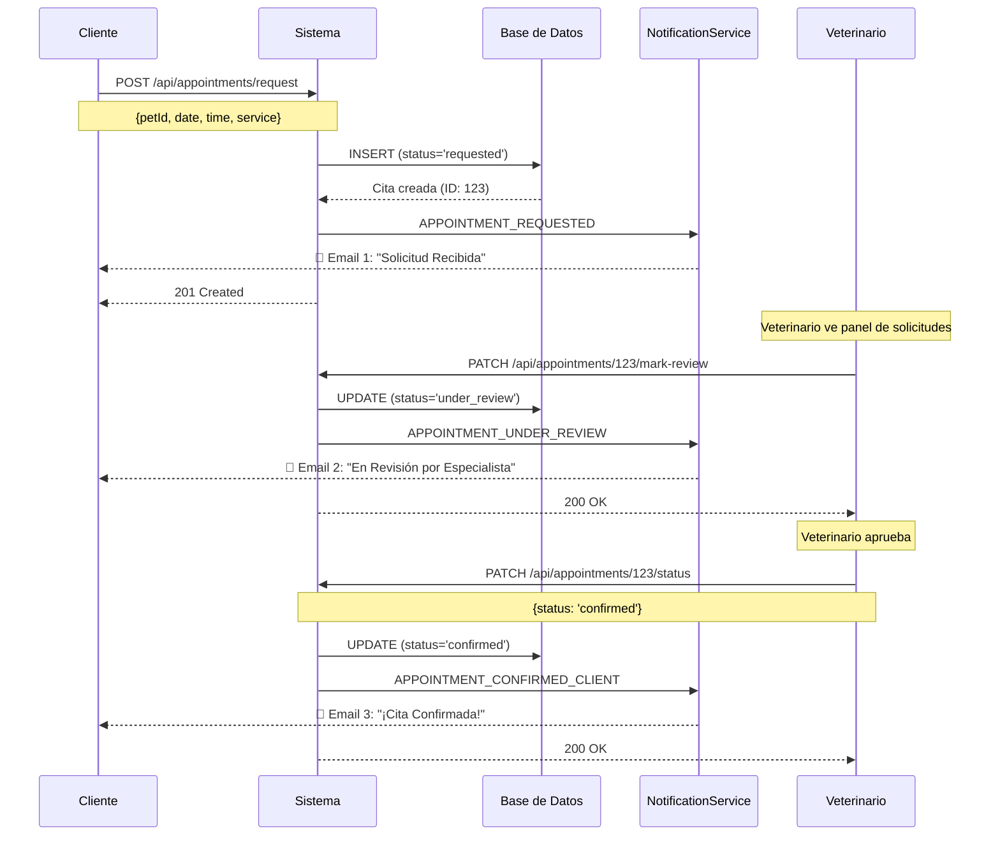
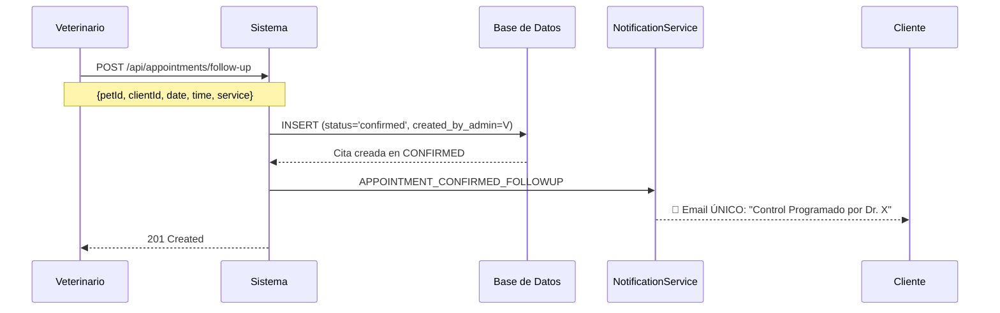
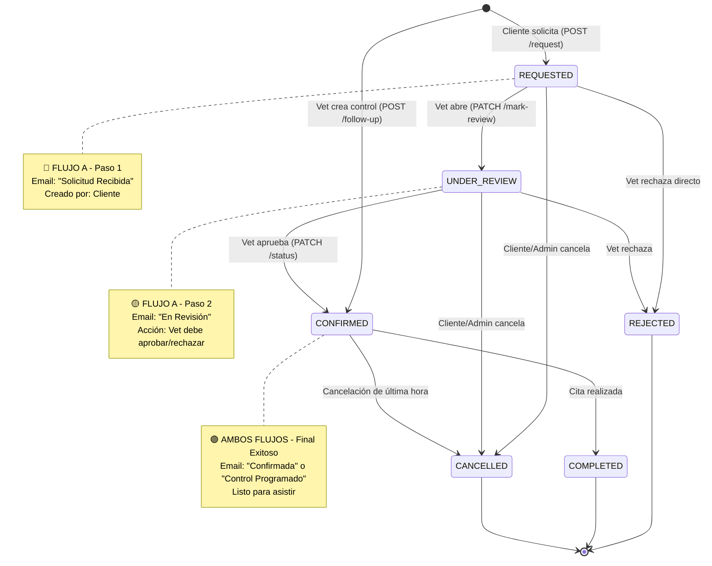

# Sistema de Ciclo de Vida de Citas - Dual Flow

## 📋 Introducción

Este documento describe el sistema completo de gestión de citas para PROVETCARE, que maneja **dos flujos distintos** de creación de citas basados en el rol del usuario:

- **FLUJO A (Cliente):** Solicitud de cita que requiere revisión → 3 notificaciones
- **FLUJO B (Veterinario):** Cita de control directa → 1 notificación

---

## 🔄 Flujos de Negocio

### FLUJO A: Cliente Solicita Cita (First-Time)

**Escenario:** Un cliente (nuevo o existente) solicita una cita a través del sistema.



**Estados del Flujo:**
1. 🔵 `requested` - Cliente solicita, sistema recibe
2. 🟡 `under_review` - Veterinario revisa disponibilidad
3. 🟢 `confirmed` - Cita aprobada y confirmada
4. 🔴 `rejected` - No disponible (estado terminal)

---

### FLUJO B: Veterinario Crea Control (Follow-Up)

**Escenario:** Un veterinario programa una cita de seguimiento para un paciente ya atendido.



**Estados del Flujo:**
1. 🟢 `confirmed` - Creada directamente confirmada (skip revisión)
2. ✅ `completed` - Tras realizarse la cita

**Lógica de Confianza:** Los veterinarios son usuarios de confianza que conocen su propia disponibilidad, por lo que sus citas se crean pre-aprobadas.

---

## 📊 Matriz de Estados vs. Notificaciones

| Acción | Trigger (Endpoint) | Estado Inicial | Estado Final | Evento | Email Enviado | ROL |
|--------|-------------------|----------------|--------------|--------|---------------|-----|
| **Cliente crea solicitud** | `POST /request` | - | `requested` | `APPOINTMENT_REQUESTED` | "Solicitud Recibida" | Cliente |
| **Vet abre solicitud** | `PATCH /:id/mark-review` | `requested` | `under_review` | `APPOINTMENT_UNDER_REVIEW` | "En Revisión" | Admin |
| **Vet aprueba solicitud** | `PATCH /:id/status` (confirmed) | `under_review` | `confirmed` | `APPOINTMENT_CONFIRMED_CLIENT` | "¡Confirmada!" | Admin |
| **Vet rechaza** | `PATCH /:id/status` (rejected) | `under_review` | `rejected` | `APPOINTMENT_REJECTED` | "No disponible + razón" | Admin |
| **Vet crea control** | `POST /follow-up` | - | `confirmed` | `APPOINTMENT_CONFIRMED_FOLLOWUP` | "Control Programado" | Admin |
| **Completar cita** | `PATCH /:id/status` (completed) | `confirmed` | `completed` | - | Ninguno | Admin |
| **Cancelar cita** | `PATCH /:id/status` (cancelled) | cualquiera | `cancelled` | - | Ninguno | Admin/Cliente |

---

## 🗺️ Máquina de Estados Completa



---

## 📧 Sistema de Notificaciones

### Arquitectura: Event-Driven con NotificationService

**Diseño:**
```javascript
// Controlador (Lógica de Negocio)
await NotificationService.notifyAppointmentEvent(
    'APPOINTMENT_REQUESTED',  // Tipo de evento
    appointment,              // Contexto de la cita
    client,                   // Destinatario
    metadata                  // Info adicional (vetName, reason, etc.)
);

// NotificationService (Orquestador)
switch(event) {
    case 'APPOINTMENT_REQUESTED':
        return await sendRequestedEmail(appointment, client);
    case 'APPOINTMENT_UNDER_REVIEW':
        return await sendUnderReviewEmail(appointment, client);
    // ...
}
```

**Beneficios:**
- ✅ **DRY:** No duplicar lógica de emails
- ✅ **Testeable:** Mock fácil en tests unitarios
- ✅ **Extensible:** Agregar SMS/Push sin tocar controladores
- ✅ **Desacoplado:** Lógica de negocio separada de notificaciones

### Templates de Email

#### 1. APPOINTMENT_REQUESTED (Email 1/3 - Cliente)
**Cuándo:** Cliente crea solicitud vía `POST /request`  
**Asunto:** "✅ Solicitud de Cita Recibida - PROVETCARE"  
**Contenido:**
- Confirmación de recepción
- Detalles solicitados (fecha, hora, servicio)
- Estado: 📝 SOLICITADA
- Mensaje: "Un veterinario revisará tu solicitud pronto"

#### 2. APPOINTMENT_UNDER_REVIEW (Email 2/3 - Cliente)
**Cuándo:** Vet marca como "en revisión" vía `PATCH /:id/mark-review`  
**Asunto:** "👀 Tu Cita Está en Revisión - PROVETCARE"  
**Contenido:**
- Notificación de revisión activa
- Detalles de la cita
- Estado: 🟡 EN REVISIÓN POR ESPECIALISTA
- Mensaje: "Te notificaremos si es confirmada"

#### 3. APPOINTMENT_CONFIRMED_CLIENT (Email 3/3 - Cliente)
**Cuándo:** Vet aprueba solicitud vía `PATCH /:id/status` (confirmed)  
**Asunto:** "✅ Cita Confirmada - PROVETCARE"  
**Contenido:**
- Confirmación destacada
- Detalles completos (fecha larga, hora, servicio)
- Estado: 🟢 CONFIRMADA
- Instrucciones: Llegar 10 min antes, traer cartilla

#### 4. APPOINTMENT_CONFIRMED_FOLLOWUP (Email ÚNICO - Vet crea control)
**Cuándo:** Vet crea control vía `POST /follow-up`  
**Asunto:** "📅 Cita de Control Programada - PROVETCARE"  
**Contenido:**
- Nombre del veterinario que programa
- Detalles de la cita
- Estado: 🟢 CONFIRMADA
- Contexto: "Cita de seguimiento para verificar salud"

#### 5. APPOINTMENT_REJECTED (Email alternativo - Rechazo)
**Cuándo:** Vet rechaza vía `PATCH /:id/status` (rejected)  
**Asunto:** "🔴 Cita No Disponible - PROVETCARE"  
**Contenido:**
- Notificación de no disponibilidad
- Razón del rechazo (campo `adminNotes`)
- Estado: 🔴 NO DISPONIBLE
- CTA: "Agenda nueva cita con otra fecha/hora"

---

## 🔧 Implementación Técnica

### Decisiones de Diseño

#### 1. ¿Campo `type` en la tabla?

**Decisión:** ❌ NO agregar campo `type`

**Razonamiento:**
- El tipo se deduce del campo `created_by_admin`
- `created_by_admin IS NULL` → Solicitud de cliente (FLUJO A)
- `created_by_admin = <vet_id>` → Control de vet (FLUJO B)
- Evita redundancia y mantiene modelo limpio

**Implementación:**
```javascript
// En el controlador
const isVetCreated = req.user.role === 'admin';
const initialStatus = isVetCreated ? 'confirmed' : 'requested';
```

#### 2. Estados en Base de Datos

**Migración:** `002_expand_appointment_states.sql`

**Nuevos estados agregados:**
- `requested` - Cliente solicita
- `under_review` - Vet revisa
- `confirmed` - Confirmada (renombrado de `approved`)

**Legacy support:**
- `pending` → migrar a `requested`
- `approved` → migrar a `confirmed`

**CHECK constraint:**
```sql
CHECK (status IN (
    'requested', 'under_review', 'confirmed',
    'approved', 'rejected', 'completed', 'cancelled', 'pending'
))
```

#### 3. Transaccionalidad de Emails

**Política:** Email falla = NO revertir cambio de estado

**Razonamiento:**
- El cambio de estado es la operación crítica
- El email es notificación secundaria
- Si falla SMTP, no bloquear flujo de negocio
- Logs registran fallo para retry manual

**Implementación:**
```javascript
try {
    await NotificationService.notifyAppointmentEvent(...);
} catch (emailError) {
    console.error('Email failed but state changed:', emailError);
    // NO throw - mantener estado actualizado
}
```

---

## 📝 Endpoints del API

### Cliente - Solicitar Cita

```http
POST /api/appointments/request
Authorization: Bearer <client_token>
Content-Type: application/json

{
  "petId": 5,
  "appointmentDate": "2026-01-20",
  "appointmentTime": "10:00",
  "serviceType": "Consulta General",
  "notes": "Mi perro tiene tos desde ayer"
}
```

**Response 201:**
```json
{
  "success": true,
  "message": "Solicitud de cita creada exitosamente",
  "data": {
    "appointment": {
      "id": 123,
      "status": "requested",
      "created_at": "2026-01-08T18:30:00Z",
      ...
    },
    "nextStep": "Un veterinario revisará tu solicitud pronto"
  }
}
```

---

### Veterinario - Marcar como "En Revisión"

```http
PATCH /api/appointments/123/mark-review
Authorization: Bearer <admin_token>
```

**Response 200:**
```json
{
  "success": true,
  "message": "Cita marcada como en revisión",
  "data": {
    "appointment": {
      "id": 123,
      "status": "under_review",
      ...
    },
    "notification": "Cliente notificado por email"
  }
}
```

---

### Veterinario - Aprobar Solicitud

```http
PATCH /api/appointments/123/status
Authorization: Bearer <admin_token>
Content-Type: application/json

{
  "status": "confirmed",
  "adminNotes": "Confirmada para esa fecha"
}
```

**Response 200:**
```json
{
  "success": true,
  "message": "Cita confirmada exitosamente",
  "data": {
    "appointment": {
      "id": 123,
      "status": "confirmed",
      "adminNotes": "Confirmada para esa fecha",
      ...
    },
    "notification": {
      "emailSent": true,
      "emailError": null
    }
  }
}
```

---

### Veterinario - Crear Cita de Control

```http
POST /api/appointments/follow-up
Authorization: Bearer <admin_token>
Content-Type: application/json

{
  "petId": 8,
  "clientId": 15,
  "appointmentDate": "2026-01-25",
  "appointmentTime": "15:00",
  "serviceType": "Control Post-Operatorio",
  "notes": "Revisión de sutura"
}
```

**Response 201:**
```json
{
  "success": true,
  "message": "Cita de control creada exitosamente",
  "data": {
    "appointment": {
      "id": 124,
      "status": "confirmed",
      "created_by_admin": 10,
      ...
    },
    "createdBy": "Dr. Carlos Veterinario",
    "notification": "Cliente notificado por email"
  }
}
```

---

## 🧪 Testing y Verificación

### 1. Migración de Base de Datos

```bash
# Ejecutar en pgAdmin o psql
psql -U postgres -d provetcare_db -f server/database/migrations/002_expand_appointment_states.sql
```

**Verificar:**
```sql
-- Verificar constraint
SELECT conname, pg_get_constraintdef(oid) 
FROM pg_constraint 
WHERE conrelid = 'appointments'::regclass AND contype = 'c';

-- Verificar columna nueva
\d appointments

-- Verificar migración de datos
SELECT status, COUNT(*) 
FROM appointments 
GROUP BY status;
```

### 2. Test de Flujo Cliente (FLUJO A)

**Paso 1: Cliente solicita**
```bash
curl -X POST http://localhost:5000/api/appointments/request \
  -H "Authorization: Bearer <client_token>" \
  -d '{"petId":5,"appointmentDate":"2026-01-20","appointmentTime":"10:00","serviceType":"Consulta"}'
```
✅ Esperado: Estado `requested`, Email 1 enviado

**Paso 2: Vet marca revisión**
```bash
curl -X PATCH http://localhost:5000/api/appointments/123/mark-review \
  -H "Authorization: Bearer <admin_token>"
```
✅ Esperado: Estado `under_review`, Email 2 enviado

**Paso 3: Vet aprueba**
```bash
curl -X PATCH http://localhost:5000/api/appointments/123/status \
  -H "Authorization: Bearer <admin_token>" \
  -d '{"status":"confirmed"}'
```
✅ Esperado: Estado `confirmed`, Email 3 enviado

### 3. Test de Flujo Veterinario (FLUJO B)

```bash
curl -X POST http://localhost:5000/api/appointments/follow-up \
  -H "Authorization: Bearer <admin_token>" \
  -d '{"petId":8,"clientId":15,"appointmentDate":"2026-01-25","appointmentTime":"15:00","serviceType":"Control"}'
```
✅ Esperado: Estado `confirmed` directo, Email único enviado

---

## 📚 Reglas de Negocio

### ¿Por qué el Veterinario se Salta la Validación?

**Lógica de Confianza:**

1. **Conocimiento Interno:** Los veterinarios conocen su propia agenda y disponibilidad
2. **Eficiencia Operativa:** Reducir pasos innecesarios para citas de seguimiento
3. **Relación Existente:** Follow-ups son para pacientes ya atendidos (confianza establecida)
4. **Control Profesional:** El vet es quien mejor sabe cuándo necesita ver al paciente nuevamente

**Contraste con Cliente:**
- Los clientes NO conocen la disponibilidad real de la clínica
- Pueden solicitar horarios ya ocupados
- Requieren validación para evitar conflictos
- Es su primera interacción (desconocidos para el sistema)

**Diagrama de Decisión:**
```
¿Quién crea la cita?
├─ Cliente → FLUJO A: requested → under_review → confirmed (3 emails)
└─ Veterinario → FLUJO B: confirmed directo (1 email)
```

---

## 🚀 Próximos Pasos

### Frontend Pendiente

1. **Formulario Cliente - Solicitar Cita**
   - Selector de mascota (dropdown con mascotas del cliente)
   - Date picker para fecha
   - Time picker para hora
   - Dropdown de servicios
   - Textarea para notas

2. **Panel Veterinario - Gestión de Solicitudes**
   - Lista de citas `requested` (pendientes)
   - Botón "Revisar" → marca como `under_review`
   - Botones "Aprobar" / "Rechazar"
   - Modal para notas de admin

3. **Panel Veterinario - Crear Control**
   - Selector de cliente
   - Selector de mascota (del cliente seleccionado)
   - Formulario de cita
   - Botón "Programar Control"

### Mejoras Futuras

1. **Validación de Disponibilidad**
   - Verificar slots disponibles en tiempo real
   - Bloquear horarios con citas existentes
   - Sugerencias de horarios alternativos

2. **Notificaciones Adicionales**
   - SMS para citas urgentes
   - Push notifications mobile
   - Recordatorios 24h antes

3. **Historial de Citas**
   - Tabla `appointment_status_history`
   - Audit trail completo
   - Reportes de tiempos de respuesta

---

## 📖 Referencias

- **Migración:** `server/database/migrations/002_expand_appointment_states.sql`
- **Servicio:** `server/services/notificationService.js`
- **Controlador:** `server/controllers/appointmentController.js`
- **Rutas:** `server/routes/appointmentRoutes.js`
- **Workflow Previo:** `docs/workflows/2026-01-08_APPOINTMENT_STATUS_WORKFLOW.md`

---

**Última Actualización:** 2026-01-08  
**Versión:** 2.0 (Dual-Flow)  
**Estado:** ✅ Implementación Backend Completa
