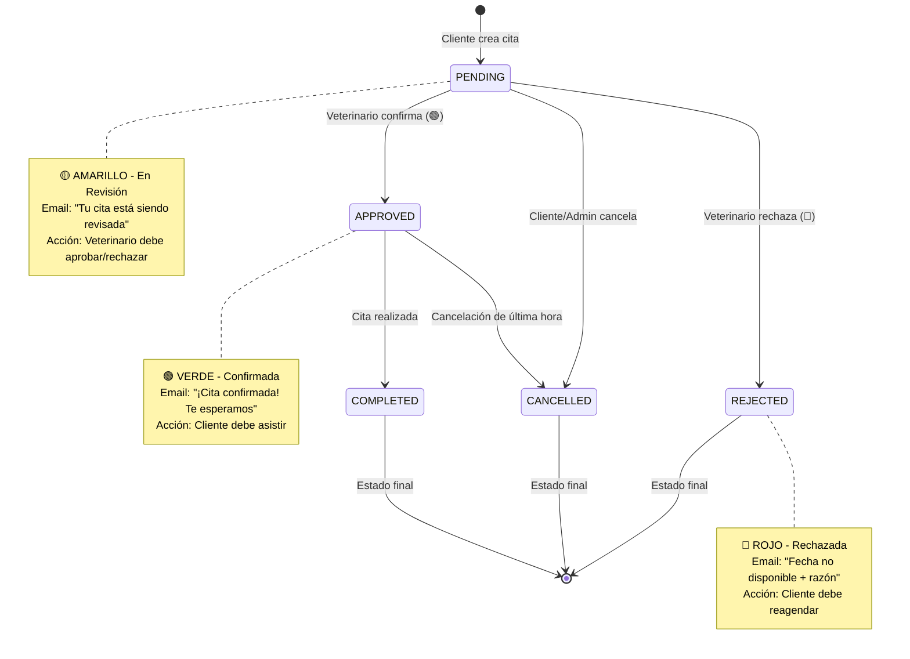

# Sistema de Control de Estado de Citas - Modelo Semáforo

## 📋 Resumen Ejecutivo

Este documento describe la implementación del **Sistema de Control de Estado de Citas** para PROVETCARE, utilizando un modelo conceptual de "Semáforo" que permite a los veterinarios administrar las solicitudes de citas entrantes y notificar automáticamente a los clientes sobre el estado de sus citas.

---

## 🚦 Lógica del Semáforo

El sistema utiliza una metáfora visual de semáforo para representar el estado de las citas:

| Color | Estado en BD | Significado | Acción del Usuario | Email Enviado |
|-------|-------------|-------------|-------------------|---------------|
| 🟡 **AMARILLO** | `pending` | **En Revisión** - La solicitud está siendo evaluada | Esperar confirmación | ✅ "Cita en revisión" |
| 🟢 **VERDE** | `approved` | **Confirmada** - La cita está aprobada para esa fecha/hora | Asistir a la cita | ✅ "Cita confirmada" |
| 🔴 **ROJO** | `rejected` | **Rechazada** - No disponible, necesita reagendar | Crear nueva cita | ✅ "Cita no disponible + razón" |
| ⚫ **GRIS** | `cancelled` | **Cancelada** - Cancelada por cliente o admin | N/A | - |
| ✅ **AZUL** | `completed` | **Completada** - Cita realizada exitosamente | N/A | - |

---

## 🔄 Diagrama de Flujo - Ciclo de Vida de una Cita



---

## 📤 Estrategia de Notificación

### 1. Email al Crear Cita (🟡 → PENDING)
**Trigger:** Cliente crea una nueva cita (automático en creación)  
**Template:** `sendAppointmentUnderReview`  
**Contenido:**
- Confirmación de recepción
- Detalles de la cita solicitada
- Mensaje: "Estamos revisando la disponibilidad"

### 2. Email al Confirmar Cita (PENDING → 🟢 APPROVED)
**Trigger:** Veterinario cambia estado a "approved"  
**Template:** `sendAppointmentConfirmed`  
**Contenido:**
- ✅ Confirmación visual destacada
- Detalles completos de la cita
- Instrucciones de llegada (10 min antes)
- Recordatorios importantes

### 3. Email al Rechazar Cita (PENDING → 🔴 REJECTED)
**Trigger:** Veterinario cambia estado a "rejected"  
**Template:** `sendAppointmentRejected`  
**Contenido:**
- Notificación de rechazo
- **Razón del rechazo** (campo `adminNotes`)
- Invitación a reagendar con nueva fecha

### Política de Envío
- ✅ **Email automático** para: PENDING → APPROVED, PENDING → REJECTED
- ❌ **Sin email automático** para: CANCELLED, COMPLETED (pueden agregarse en el futuro)
- **Estrategia de transaccionalidad:** Si el email falla, el cambio de estado SE MANTIENE

---

## 🔐 Máquina de Estados - Transiciones Válidas

```javascript
const VALID_TRANSITIONS = {
    'pending':   ['approved', 'rejected', 'cancelled'],
    'approved':  ['cancelled', 'completed'],
    'rejected':  [],  // Estado final - no puede cambiar
    'completed': [],  // Estado final - trabajo completado
    'cancelled': []   // Estado final - no puede reactivarse
};
```

### Reglas de Negocio

1. **Una cita PENDING puede:**
   - ✅ Ser aprobada por el veterinario → `approved`
   - ✅ Ser rechazada por el veterinario → `rejected`
   - ✅ Ser cancelada por el cliente/admin → `cancelled`

2. **Una cita APPROVED puede:**
   - ✅ Ser completada tras la consulta → `completed`
   - ✅ Ser cancelada (última hora) → `cancelled`

3. **Estados finales (no pueden cambiar):**
   - ❌ `rejected` - El cliente debe crear una NUEVA cita
   - ❌ `completed` - La cita ya ocurrió
   - ❌ `cancelled` - No puede reactivarse

---

## 🛠️ Uso del API

### Endpoint para Actualizar Estado

**URL:** `PATCH /api/appointments/:id/status`  
**Autenticación:** Bearer Token (JWT)  
**Permisos:** Solo usuarios con `role='admin'`

#### Request Body

```json
{
  "status": "approved",
  "adminNotes": "Confirmada para esa fecha y hora"
}
```

**Campos:**
- `status` (string, requerido): Nuevo estado. Valores: `approved`, `rejected`, `cancelled`, `completed`
- `adminNotes` (string, opcional): Notas del administrador, especialmente importante en `rejected` para explicar el motivo

#### Ejemplo: Aprobar Cita (🟡 → 🟢)

```bash
curl -X PATCH http://localhost:5000/api/appointments/123/status \
  -H "Authorization: Bearer eyJhbGci..." \
  -H "Content-Type: application/json" \
  -d '{
    "status": "approved",
    "adminNotes": "Confirmada, consultorio disponible"
  }'
```

**Response 200 OK:**
```json
{
  "success": true,
  "message": "Cita confirmada exitosamente",
  "data": {
    "appointment": {
      "id": 123,
      "status": "approved",
      "appointmentDate": "2026-01-15",
      "appointmentTime": "10:00:00",
      "serviceType": "Consulta General",
      "adminNotes": "Confirmada, consultorio disponible",
      "updatedAt": "2026-01-08T18:20:00.000Z"
    },
    "notification": {
      "emailSent": true,
      "emailError": null
    }
  }
}
```

#### Ejemplo: Rechazar Cita (🟡 → 🔴)

```bash
curl -X PATCH http://localhost:5000/api/appointments/124/status \
  -H "Authorization: Bearer eyJhbGci..." \
  -H "Content-Type: application/json" \
  -d '{
    "status": "rejected",
    "adminNotes": "Agenda llena para ese día, por favor seleccionar otra fecha"
  }'
```

**Response 200 OK:**
```json
{
  "success": true,
  "message": "Cita rechazada exitosamente",
  "data": {
    "appointment": {
      "id": 124,
      "status": "rejected",
      "adminNotes": "Agenda llena para ese día, por favor seleccionar otra fecha",
      ...
    },
    "notification": {
      "emailSent": true,
      "emailError": null
    }
  }
}
```

#### Ejemplo: Transición Inválida

```bash
# Intentar cambiar de 'completed' a 'pending'
{
  "status": "pending"
}
```

**Response 400 Bad Request:**
```json
{
  "success": false,
  "message": "Transición inválida: No se puede cambiar de \"completed\" a \"pending\"",
  "error": "INVALID_STATE_TRANSITION",
  "currentStatus": "completed",
  "requestedStatus": "pending",
  "allowedTransitions": []
}
```

---

## 📊 Endpoints Adicionales

### Obtener Citas Pendientes

**URL:** `GET /api/appointments/pending`  
**Descripción:** Lista todas las citas en estado `pending` que requieren revisión  
**Permisos:** Solo admins

**Response:**
```json
{
  "success": true,
  "data": {
    "appointments": [
      {
        "id": 125,
        "status": "pending",
        "appointmentDate": "2026-01-20",
        "appointmentTime": "14:00:00",
        "serviceType": "Vacunación",
        "clientName": "Juan Pérez",
        "clientEmail": "juan@example.com",
        "petName": "Max",
        "petSpecies": "Perro"
      }
    ],
    "count": 1
  }
}
```

### Obtener Todas las Citas (con filtros)

**URL:** `GET /api/appointments?status=approved&date=2026-01-15`  
**Descripción:** Lista citas con filtros opcionales  
**Permisos:** Solo admins

**Query Params:**
- `status` (opcional): Filtrar por estado
- `date` (opcional): Filtrar por fecha (YYYY-MM-DD)

---

## 🔧 Configuración Técnica

### Variables de Entorno (.env)

```bash
# Email Service (SMTP)
EMAIL_HOST=smtp.gmail.com
EMAIL_PORT=587
EMAIL_USER=tu-email@gmail.com
EMAIL_PASSWORD=tu-app-password  # Generar en configuración de Gmail
```

### Inicialización del Servicio

El `EmailService` se inicializa automáticamente en el primer envío. Si las credenciales no están configuradas, simula el envío (modo desarrollo).

```javascript
// En desarrollo sin credenciales
console.log('📧 [EMAIL SIMULATED]: Cita confirmada to cliente@example.com');
```

---

## 🧪 Testing Manual

### Setup Inicial

1. **Crear un usuario admin:**
   ```sql
   UPDATE users SET role = 'admin' WHERE email = 'admin@provetcare.com';
   ```

2. **Obtener token de admin:**
   ```bash
   POST /api/auth/login
   {
     "email": "admin@provetcare.com",
     "password": "admin123"
   }
   ```

3. **Crear una cita de prueba (como cliente):**
   ```bash
   POST /api/appointments
   {
     "petId": 1,
     "appointmentDate": "2026-01-20",
     "appointmentTime": "10:00",
     "serviceType": "Consulta General"
   }
   ```

### Pruebas de Estados

**Test 1: Aprobar cita pendiente**
```bash
PATCH /api/appointments/1/status
{ "status": "approved" }
```
✅ Esperado: Estado cambia, email de confirmación enviado

**Test 2: Rechazar con razón**
```bash
PATCH /api/appointments/2/status
{
  "status": "rejected",
  "adminNotes": "No hay disponibilidad ese día"
}
```
✅ Esperado: Estado cambia, email con razón enviado

**Test 3: Intentar transición inválida**
```bash
PATCH /api/appointments/3/status
{ "status": "pending" }  # Desde 'completed'
```
❌ Esperado: Error 400 "Transición inválida"

**Test 4: Acceso sin permisos admin**
```bash
# Con token de cliente
PATCH /api/appointments/1/status
{ "status": "approved" }
```
❌ Esperado: Error 403 "Acceso denegado"

---

## 🔒 Seguridad

### Control de Acceso
- ✅ Solo usuarios con `role='admin'` pueden cambiar estados
- ✅ Validación de JWT en cada request
- ✅ Validación de transiciones en backend (no confía en frontend)

### Prevención de Abuso
- ✅ Rate limiting global (100 req/15min)
- ✅ Validación estricta de input (Zod podría agregarse)
- ✅ Logs de cambios de estado para auditoría

### Protección de Datos
- ✅ Emails solo a destinatarios legítimos (cliente de la cita)
- ✅ No se exponen datos sensibles en logs de producción
- ✅ HTTPS requerido en producción (helmet middleware)

---

## 📈 Escalabilidad y Mejoras Futuras

### Optimizaciones Sugeridas

1. **Cola de Emails (Message Queue)**
   - Usar Bull + Redis para manejo asíncrono robusto
   - Retry automático de emails fallidos
   - Mejor performance bajo alta carga

2. **Template Engine**
   - Migrar a Handlebars o EJS para templates más mantenibles
   - Separar HTML de lógica (archivos `.hbs`)

3. **Webhooks**
   - Permitir integraciones externas mediante webhooks
   - Notificar cambios de estado a sistemas terceros

4. **Auditoría Completa**
   - Tabla `appointment_status_history` para trackear todos los cambios
   - Log de quién cambió qué y cuándo

5. **Notificaciones Adicionales**
   - SMS para citas urgentes
   - Push notifications en app móvil
   - Recordatorios 24h antes de la cita

---

## 🐛 Troubleshooting

### Email no se envía

**Problema:** `emailSent: false` o `emailError: "Connection refused"`

**Soluciones:**
1. Verificar credenciales en `.env`
2. Para Gmail, generar "App Password" en configuración de seguridad
3. Verificar que EMAIL_PORT sea 587 (TLS) no 465 (SSL)
4. Revisar firewall/antivirus bloqueando puerto SMTP

### Estado cambia pero email falla

**Comportamiento:** Estado actualizado correctamente, `emailError` presente

**Explicación:** Esto es **intencional**. La política de transaccionalidad mantiene el cambio de estado crítico aunque el email falle. El error se loguea para retry manual.

**Acción:** Revisar logs del servidor y reenviar email manualmente si es necesario.

### Transición rechazada

**Problema:** Error 400 "Transición inválida"

**Causa:** Intento de cambiar a un estado no permitido por la máquina de estados

**Solución:** Verificar estado actual de la cita y consultar tabla de transiciones válidas en este documento.

---

## 📚 Arquitectura de Archivos

```
server/
├── services/
│   └── emailService.js         # Servicio de envío de correos (nodemailer)
├── controllers/
│   └── appointmentController.js # Lógica de actualización de estados
├── routes/
│   └── appointmentRoutes.js    # Definición de endpoints
├── middleware/
│   └── authMiddleware.js       # requireAdmin (ya existía)
└── server.js                   # Integración de rutas
```

---

## ✅ Checklist de Implementación

- [x] EmailService con 3 templates HTML
- [x] appointmentController con state machine
- [x] appointmentRoutes con middleware admin
- [x] requireAdmin middleware (ya existía)
- [x] Integración en server.js (ya existía)
- [x] Variables de entorno documentadas
- [x] Documentación técnica completa
- [ ] Testing en entorno de desarrollo
- [ ] Configuración de Gmail SMTP real
- [ ] Pruebas end-to-end con clientes reales

---

## 📞 Contacto y Soporte

Para preguntas sobre la implementación de este sistema:

- **Documentación Técnica:** Este archivo
- **Código Fuente:** `server/controllers/appointmentController.js`
- **Logs del Sistema:** `console.log` en servidor

---

**Última Actualización:** 2026-01-08  
**Versión del Sistema:** 1.0  
**Autor:** PROVETCARE Development Team
